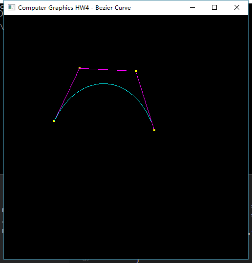

## Homework4

### Dependencies

* OpenGL
* GLU
* freeglut (locally included)

### Results



### How to build

* With GNU Make:

```bash
    make & main
```

* With [premake5](http://premake.github.io/index.html), you can run with different system or IDE, there are VS, XCode.

Run `premake5 --help` to get help infomation.

```bash
    premake5 gmake
    premake5 vs2015
    premake5 xcode4
```
