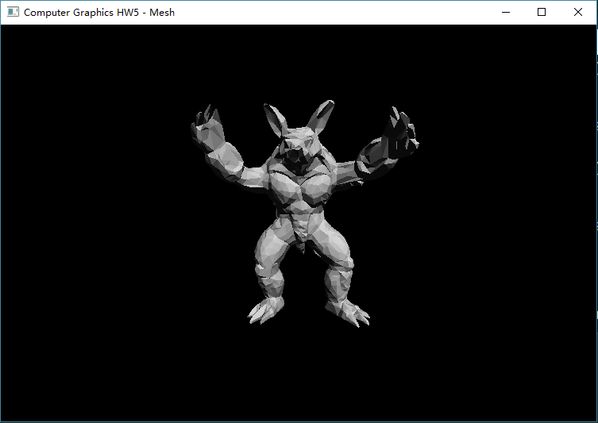
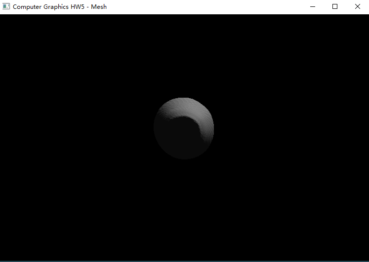
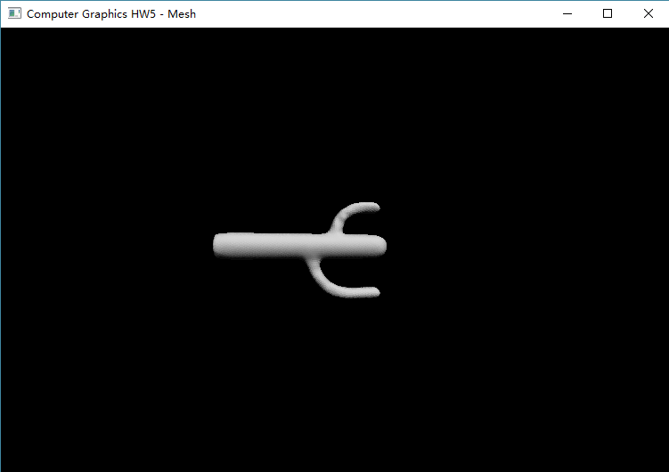
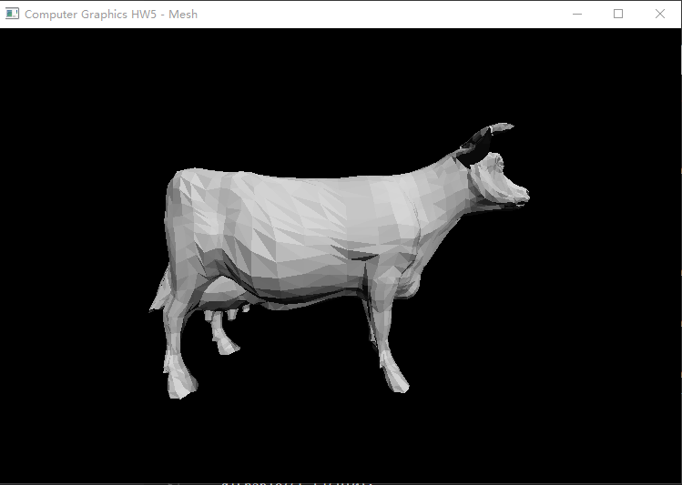
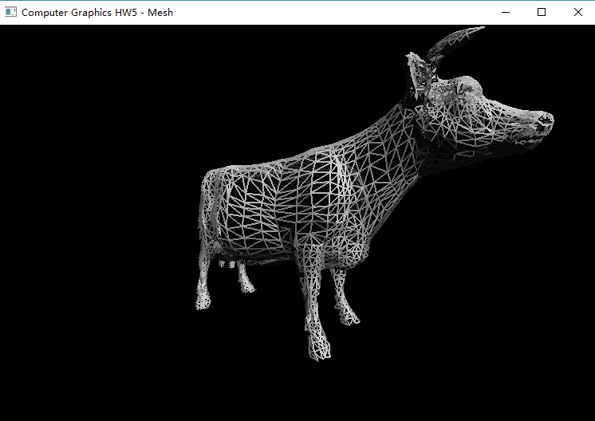
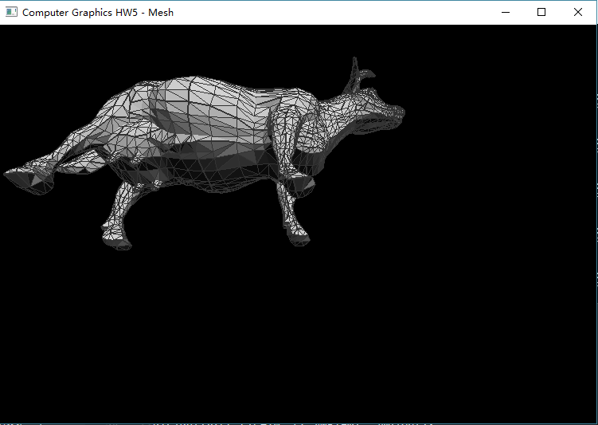

## Homework5

### Dependencies

* OpenGL
* GLU
* freeglut (locally included)

### Results








### How to build

* With GNU Make:

```bash
    make & main
```

* With [premake5](http://premake.github.io/index.html), you can run with different system or IDE, there are VS, XCode.

Run `premake5 --help` to get help infomation.

```bash
    premake5 gmake
    premake5 vs2015
    premake5 xcode4
```

### How to use

1. Build
2. Run main
3. Input file(In `data` folder) and style(Wireframe or Flat or Flat lines).
4. Press `W`, `S`, `A`, `D` to rotate model. Draw left mouth's button to move model.
